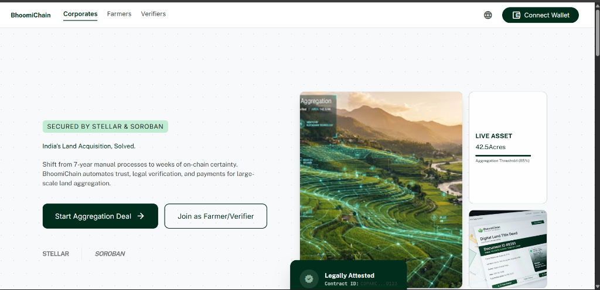
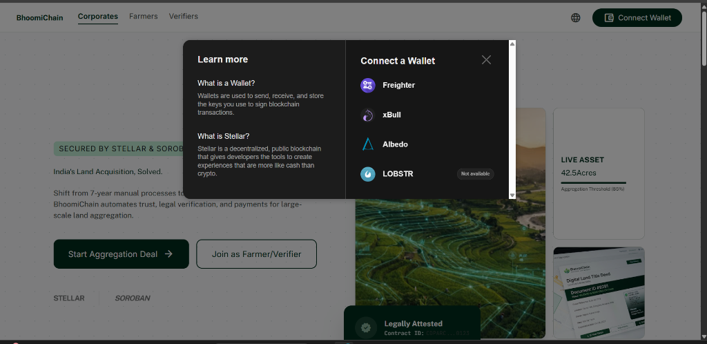
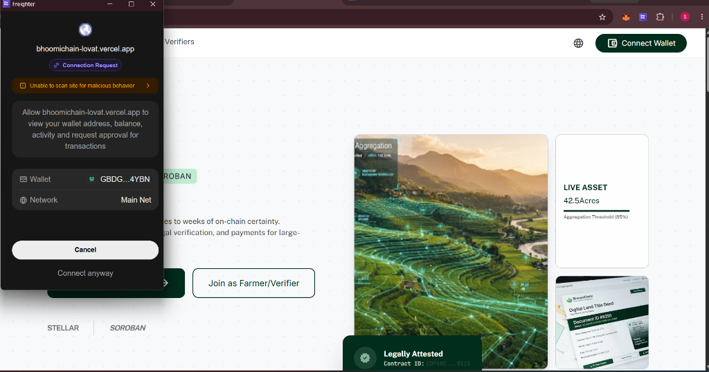
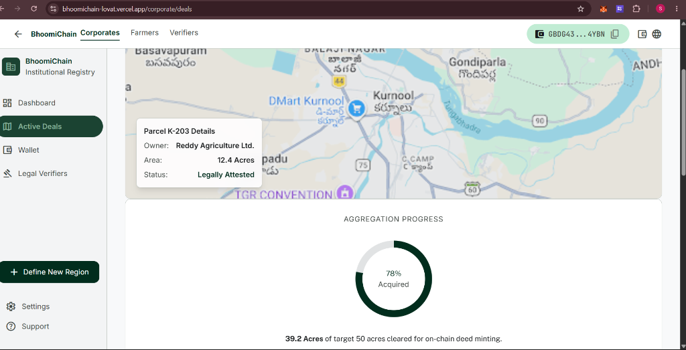
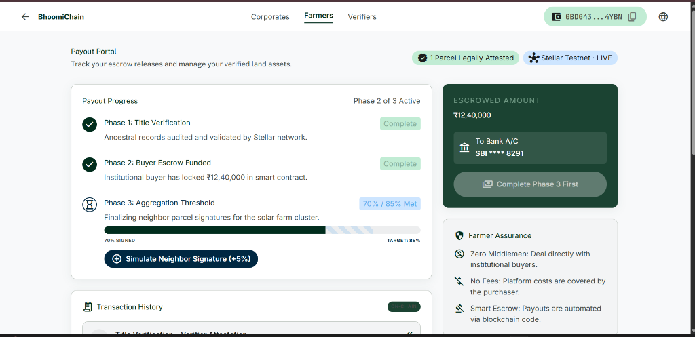

<div align="center">

# 🌾 BhoomiChain

### Decentralized Land Aggregation & Escrow on Stellar

*Trustless land title aggregation for Indian smallholder farmers, powered by Stellar Soroban smart contracts.*

<br/>

## 🚀 **[LIVE DEMO → https://bhoomichain-lovat.vercel.app/](https://bhoomichain-lovat.vercel.app/)**

<br/>

[](https://bhoomichain-lovat.vercel.app/)
[](https://stellar.org)
[](https://soroban.stellar.org)
[](https://react.dev)
[](LICENSE)

</div>

---

## 🔗 Live Deployment

> ### ✨ **[https://bhoomichain-lovat.vercel.app/](https://bhoomichain-lovat.vercel.app/)**
>
> The app is fully deployed on Vercel. Click the link above to explore the live platform — no setup required.

---

## 📸 Screenshots

### 🏠 Landing Page — Hero

*India's Land Acquisition, Solved — with live on-chain asset bento grid*

---

### 🔐 Wallet Connection Modal

*Connect via Freighter, xBull, Albedo, or LOBSTR — built-in Stellar wallet guide*

---

### 🦊 Freighter Extension — Live Connection

*Real Freighter popup requesting access to bhoomichain-lovat.vercel.app*

---

### 🗺️ Corporate Dashboard — Map & Aggregation Progress

*Live map showing parcel K-203 (Kurnool, 12.4 Acres) · 78% aggregation progress ring · 39.2/50 acres cleared*

---

### 💰 Farmer Payout Portal — Escrow Tracker

*Phase 2 of 3 Active · ₹12,40,000 escrowed to SBI ****8291 · Simulate neighbor signature to advance threshold*

---

## 🧭 What is BhoomiChain?

BhoomiChain solves one of India's most complex infrastructure problems: **large-scale land aggregation**. Acquiring hundreds of small agricultural plots from individual farmers for infrastructure projects (highways, solar farms, industrial corridors) typically takes **7+ years** of manual bureaucracy, disputed titles, and delayed payouts.

BhoomiChain replaces this with:
- 🔐 **On-chain title attestation** by staked legal verifiers
- 💰 **Atomic escrow payout** via Soroban smart contracts — farmers receive funds the moment verification threshold is met
- 📄 **Tokenized land parcels** — every deed becomes a digital asset on Stellar
- 🗳️ **Dispute DAO** — on-chain governance for contested attestations
- 🌍 **Multi-language support** — English, हिन्दी, తెలుగు, ಕನ್ನಡ

---

## 👥 Roles

| Role | Description |
|------|-------------|
| 🧑‍🌾 **Farmer** | Registers land parcels, submits documents, monitors payout status |
| 🏢 **Corporate Buyer** | Creates aggregation deals, funds escrow, monitors attestation progress |
| ⚖️ **Verifier** | Licensed attorney/surveyor — stakes XLM, attests parcel ownership, votes on disputes |
| 🔑 **Admin** | BhoomiChain DAO multisig — can suspend verifiers, freeze parcels, cancel deals |

---

## ⚙️ Tech Stack

| Layer | Technology |
|-------|-----------|
| **Blockchain** | Stellar Testnet + Soroban Smart Contracts (Rust/WASM) |
| **Frontend** | React 18, TypeScript (strict), Tailwind CSS v4, Vite |
| **Wallet** | Freighter, Albedo, Lobstr, xBull — `@creit.tech/stellar-wallets-kit` |
| **i18n** | English, हिन्दी, తెలుగు, ಕನ್ನಡ — `react-i18next` |
| **Deployment** | Vercel (frontend) · GitHub Actions (CI/CD) |

---

## 🛠️ Smart Contracts

| Contract | Description |
|----------|-------------|
| `verifier-registry` | Verifier staking, reputation scoring, slashing |
| `parcel-token` | Land parcel tokenization, freeze/clawback |
| `aggregation-deal` | Core escrow, threshold verification, atomic payout |
| `dispute-dao` | DAO voting on disputed attestations |

### Deployed Contracts (Testnet)

| Contract | Testnet Contract ID | Stellar Expert |
|----------|---------------------|----------------|
| `verifier-registry` | _TBD_ | _TBD_ |
| `parcel-token` | _TBD_ | _TBD_ |
| `aggregation-deal` | _TBD_ | _TBD_ |
| `dispute-dao` | _TBD_ | _TBD_ |

---

## 🚀 Local Development

```bash
# 1. Clone the repo
git clone https://github.com/your-org/bhoomichain.git
cd bhoomichain

# 2. Install frontend dependencies
npm install --legacy-peer-deps

# 3. Start the dev server
npm run dev
# → Opens at http://localhost:5173/
```

### Smart Contracts

```bash
# Run all Rust unit tests
cargo test --workspace

# Lint (zero warnings policy)
cargo clippy --all-targets --all-features -- -D warnings

# Build WASM contracts
cargo build --target wasm32-unknown-unknown --release
```

---

## 📁 Project Structure

```
.
├── contracts/
│   ├── verifier-registry/   # Verifier staking, reputation, slashing
│   ├── parcel-token/        # Land parcel tokenization, freeze/clawback
│   ├── aggregation-deal/    # Core escrow, threshold, atomic payout
│   └── dispute-dao/         # DAO voting on disputed attestations
├── crates/
│   └── bhoomi-math/         # Pure Rust: split calculations, GPS validation
├── src/
│   ├── components/          # Pure render components — zero SDK imports
│   ├── hooks/               # useWallet, useLedgerEvents, useTheme
│   ├── lib/                 # ALL Stellar/Soroban SDK calls live here
│   ├── config/              # Stellar config (Horizon URL, RPC, contract IDs)
│   ├── types/               # Shared TypeScript domain types
│   ├── utils/               # errors, validation, format, pdf, localRegistry
│   ├── i18n/                # en, hi, te, kn translations
│   └── pages/
│       ├── Landing.tsx
│       ├── corporate/       # Dashboard, DealDetail
│       ├── farmer/          # Home, PayoutPortal, DocumentSubmission
│       ├── verifier/        # Workspace, ParcelVerification
│       └── settings/        # Language
└── .github/workflows/       # CI + Contract Deployment
```

---

## ✅ Quality Standards

### Rust / Soroban
- Zero `clippy` warnings (`-D warnings` enforced in CI)
- Every contract function has doc comments (purpose, params, returns, panics, events)
- Typed `DataKey` enum — raw string storage keys forbidden
- Typed `Status` enum with `transition_to()` state machine
- Zero `.unwrap()` — all `Option`/`Result` explicitly handled
- Checked arithmetic everywhere (`checked_add`, `checked_mul`, etc.)
- Newtypes for domain primitives (`Amount`, `BasisPoints`, `ParcelId`)

### TypeScript / Frontend
- `noUncheckedIndexedAccess: true`, `exactOptionalPropertyTypes: true`
- Zero `any`, zero `as unknown`, zero non-null assertions
- All Stellar SDK calls isolated in `src/lib/`
- All blockchain strings wrapped in `<BlockchainString>` component
- Named exported React functions (no anonymous arrow components)
- `import type` for all type-only imports

### Performance Budget
- Main bundle: < 250 KB gzipped
- Unrelated data fetched concurrently via `Promise.all`
- Search inputs debounced ≥ 300ms
- Route-level lazy loading from Phase 3

---

## 📋 Development Commands

```bash
# Frontend
npm run dev          # Start local dev server (port 5173)
npm run type-check   # TypeScript strict check (zero errors required)
npm run lint         # ESLint
npm run test         # Vitest unit tests
npm run build        # Production bundle (< 250 KB target)

# Contracts
cargo test --workspace                                          # All Rust tests
cargo clippy --all-targets --all-features -- -D warnings       # Zero warnings
cargo fmt --check                                              # Format check
cargo build --target wasm32-unknown-unknown --release           # WASM build
```

---

## 🔐 Environment Setup

Copy `.env.example` to `.env.local`:

```env
VITE_HORIZON_URL=https://horizon-testnet.stellar.org
VITE_RPC_URL=https://soroban-testnet.stellar.org
VITE_NETWORK_PASSPHRASE="Test SDF Network ; September 2015"
VITE_CONTRACT_VERIFIER_REGISTRY=C...
VITE_CONTRACT_PARCEL_TOKEN=C...
VITE_CONTRACT_AGGREGATION_DEAL=C...
VITE_CONTRACT_DISPUTE_DAO=C...
```

---

## 📄 License

MIT — BhoomiChain is open-source infrastructure for equitable land markets.

---

<div align="center">

**Built with ❤️ for India's farmers · Powered by [Stellar](https://stellar.org) & [Soroban](https://soroban.stellar.org)**

### 🌐 [https://bhoomichain-lovat.vercel.app/](https://bhoomichain-lovat.vercel.app/)

</div>
